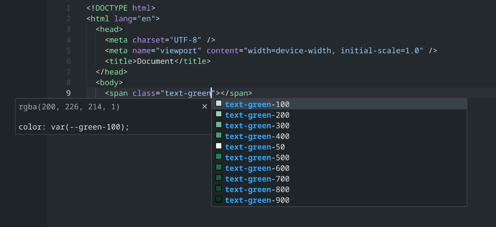

# Primeflex IntelliSense

Primeflex IntelliSense enhances the [PrimeFlex](https://primefaces.org/primeflex/) development experience by providing Visual Studio Code users with smart class name completions, color previews, and seamless integration with your style variables.

## Installation

**[Install via the Visual Studio Code Marketplace →](https://marketplace.visualstudio.com/items?itemName=yourpublisher.primeflex-intellisens)**

Once installed, the extension automatically activates when a supported project containing PrimeFlex classes or your defined stylesheet variables is detected.

To ensure full functionality, make sure your project has a valid CSS file containing the PrimeFlex variables.

---

## Features

### Autocomplete

Get intelligent suggestions for PrimeFlex class names directly inside your HTML, JSX, or template files.



### Color Previews

Preview color variables inline for quick visual reference when working with custom themes.

### Fast Context Switching

Navigate between multiple projects smoothly. You can control whether Primeflex IntelliSense is active globally or per workspace.

---

## Extension Commands

### `Primeflex: Restart Colors`

When you update your style file or need to refresh the extension’s reference to the stylesheet, run this command from the **Command Palette** (`Ctrl+Shift+P` / `Cmd+Shift+P`).

---

## Recommended VS Code Settings

### `primeflex.theme`

Defines the CSS file containing the variables that PrimeFlex IntelliSense uses.

**Default:** `./src/styles/primeflex.css`

```json
"primeflex.theme": "./src/styles/primeflex.css"
```

---

### `primeflex.enabled`

Control whether Primeflex IntelliSense is active per project or globally.
By default, it’s enabled everywhere — but you can customize this in your workspace settings:

```json
"primeflex.enabled": true
```

You can disable it globally or configure it in `.vscode/settings.json` for finer control.

---

### `primeflex.classAttributes`

Specifies which HTML attributes provide class completions.
**Default:** `["class", "className", "styleClass", "ngClass", "class:list"]`

```json
"primeflex.classAttributes": [
  "class",
  "className",
  "styleClass",
  "ngClass",
  "class:list"
]
```

---

## Troubleshooting

If you’re not seeing IntelliSense suggestions:

- Ensure your configured `primeflex.theme` path points to a valid CSS file.
- Run `Primeflex: Restart Colors` after updating your styles.
- Check your workspace settings to confirm the extension is enabled.
- Reload VS Code after changing any related configuration.
